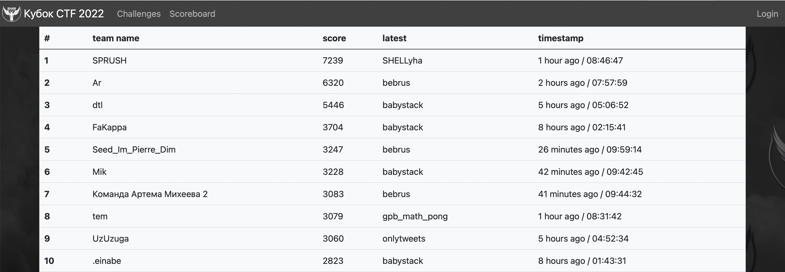

# Отборочный этап VI Кубка CTF России

Исходные коды, разборы, эксплоиты и файлы для деплоя заданий с отборочного тура VI Кубка CTF России, который проходил 19-20 ноября 2022 года в онлайн-формате.

[Сайт соревнований](https://ctfcup.ru/)

Генеральный партнер соревнований - **Газпромбанк**\
Официальный партнер - **СБЕР**\
Стратегический партнер - **RDP**\
Технологические партнеры - **EdgeCenter** и **UserGate**\
Партнеры - **PositiveTechnologies**, **НТЦ Вулкан**, **Координационный центр доменов .RU/.РФ**

 Таск                                                                                      | Категория | Баллы | Кол-во решений | Автор |
| ---------------------------------------------------------------------------------------- | --------- | ----- | -------------- | ----- |
| [Good pad / bad pad](tasks/crypto/good_pad_bad_pad/README.md)                            | crypto    | 1000  | 0              | @bork_dog      |
| [Important task](tasks/crypto/important_task/README.md)                                  | crypto    | 213   | 38             | @bork_dog      |
| [Dinosaurs](tasks/crypto/dinosaurs/README.md)                                            | crypto    | 1000  | 1              | @bork_dog      |
| [The time has come](tasks/crypto/the_time_has_come/README.md)                            | crypto    | 909   | 2              | @bork_dog      |
| [Stolen blueprints](tasks/crypto/stolen_blueprints/README.md)                            | crypto    | 333   | 21             | @bork_dog      |
| [onlytweets](tasks/web/onlytweets/README.md)                                             | web       | 833   | 3              | @jnovikov      |
| [warmup](tasks/web/warmup/README.md)                                                     | web       | 357   | 19             | @jnovikov      |
| [legacy](tasks/web/legacy/README.md)                                                     | web       | 455   | 13             | @jnovikov      |
| [simple](tasks/web/simple/README.md)                                                     | web       | 833   | 3              | @shipko        |
| [malware_autopsy](tasks/forensics/malware_autopsy/README.md)                              | forensic  | 213   | 38             | @swissarmy     |
| [fallen_angel](tasks/forensics/fallen_angel/README.md)                                    | forensic  | 78    | 120            | @swissarmy     |
| [french_connection](tasks/forensics/french_connection/README.md)                          | forensic  | 1000  | 1              | @slyshay6      |
| [Red firmware I](tasks/forensics/Red_firmware_I/README.md)                                | forensic  | 244   | 32             | @greg0r0       |
| [Simple Encoder](tasks/reverse/simple_encoder/README.md)                                 | reverse   | 526   | 10             | @greg0r0       |
| [unicorn_plc](tasks/reverse/unicorn_plc/README.md)                                       | reverse   | 769   | 4              | @greg0r0       |
| [crackme2077](tasks/reverse/crackme2077/README.md)                                       | reverse   | 1000  | 1              | @revker        |
| [bebrus](tasks/reverse/bebrus/README.md)                                                 | reverse   | 667   | 6              | @revker        |
| [watcher](tasks/pwn/watcher/README.md)                                                   | pwn       | 1000  | 1              | @revker        |
| [SHELLyha](tasks/pwn/shellyha/README.md)                                                 | pwn       | 833   | 3              | @revker        |
| [ozne](tasks/pwn/ozne/README.md)                                                         | pwn       | 909   | 2              | @revker        |
| [babystack](tasks/pwn/babystack/README.md)                                     | pwn       | 667   | 6              | @revker        |
| [classic_matreshka](tasks/warmup/classic_matreshka/README.md)                                    | warmup    | 50    | 193            | @RegularITCat  |
| [gpb_math_pong](tasks/warmup/math_pong/README.md)                                        | warmup    | 92    | 100            | @RegularITCat  |
## Результаты

[Полный список](scoreboard/full.png)

## Инфраструктура

Инфраструктура была предоставлена компанией [EdgeCenter](https://edgecenter.ru)

- DevOps: [@Rubikoid](https://github.com/@Rubikoid)
- Checksystem: [yatb](https://github.com/kksctf/yatb)